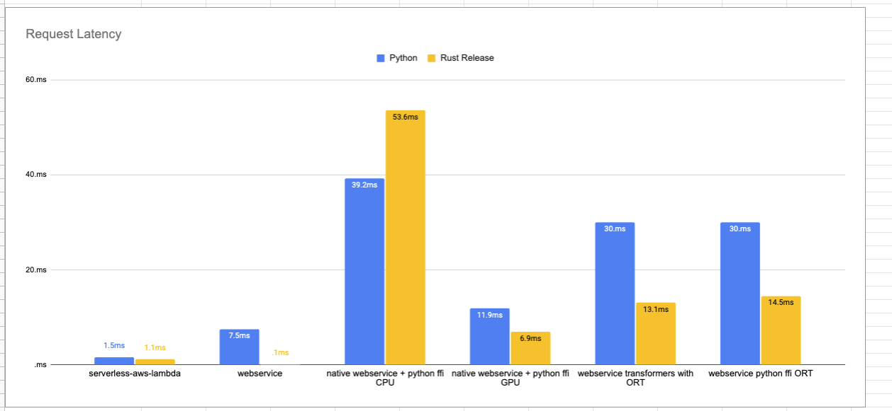

# Rust 🦀 vs Python 🐍

This repository contains the code to my blog post [Rust 🦀 vs Python 🐍: a serverless comparison Part 1](). It includes the code to deploy for each part of the blog post.

## Parts

* [Rust 🦀 vs Python 🐍: a serverless comparison Part 1](./serverless-aws-lambda/README.md)
* [Rust 🦀 vs Python 🐍: a webservice comparison Part 2](./webservice/README.md)
* [Rust 🦀 vs Python 🐍: native webservice with python ffi calls Part 3](./webservice-python-ffi/README.md)
* [Rust 🦀 vs Python 🐍: a ML webservice using ORT and Transforemrs (no optimizations) Part 4](./webservice-transformers-onnxruntime/README.md)

## Results

