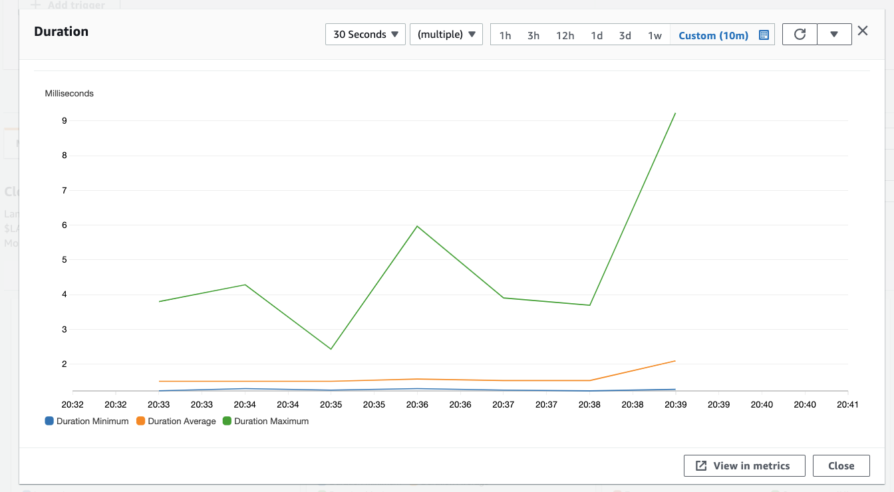
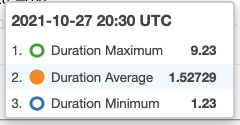
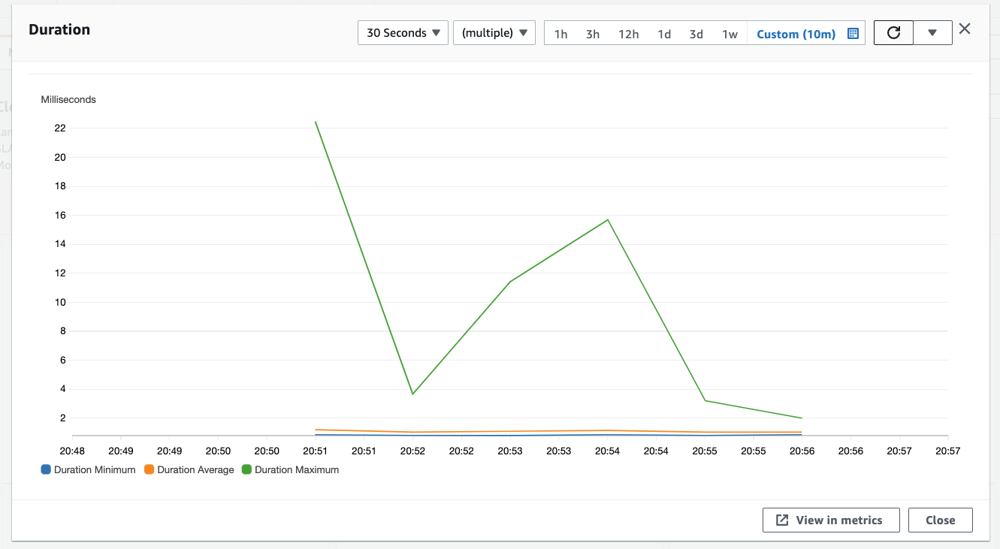
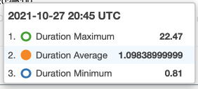

# Rust 🦀 vs Python 🐍: a serverless comparison

This repository contains the code to my blog post [Rust 🦀 vs Python 🐍: a serverless comparison Part 1](). It includes the code to deploy both Serverless functions as well as the benchmarking script. 

## Code

* [Python](./python)
* [Rust](./rust)

## Deployment

**Python**

```bash
cd python && cdk deploy
```

**Rust**

```bash
cd rust && cdk deploy
```

## Results

|         | Python | Rust  | Difference |
|---------|--------|-------|------------|
| minimum | 1.23   | 0.81  | -34.2%     |
| maximum | 9.23   | 22.47 | 143.4%     |
| p99     | 2.80   | 2.36  | -15.7%     |
| average | 1.53   | 1.10  | -28.1%     |
### Python




### Rust


