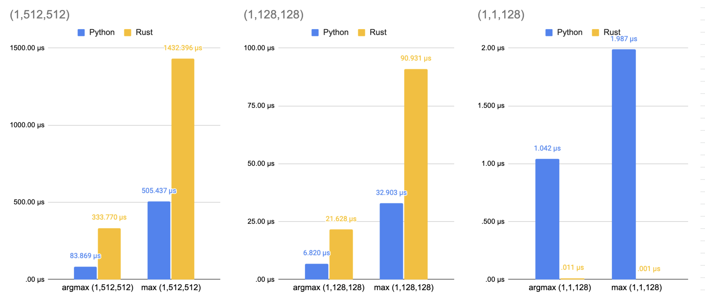

# Rust 🦀 vs Python 🐍: Numpy vs ndarray

This repository contains the code to my blog post [Rust 🦀 vs Python 🐍: Numpy vs ndarray](). It includes the code to run numpy/ndarray operations. The first tests are computing `max` and `argmax` on a [1,512,512] dimensional array

## Code

- [Python](./python)
- [Rust](./rust)

## Deployment

**Python**

```bash
cd python && python3 argmax_max.py
```

**Rust**

```bash
cd rust && cargo build --release

chmod +x ./target/release/nparray
./target/release/nparray
```

## Results



results are in microseconds for [1,512,512] array

|        | Python               | Rust Debug  | Rust Release | Difference |
| ------ | -------------------- | ----------- | ------------ | ---------- |
| max    | 507.57408142089844µs | 13955.615µs | 1416.05µs    | +279%      |
| argmax | 83.8618278503418µs   | 18216.48µs  | 294.35635µs  | +354%      |

results are in microseconds for [1,128] array

|        | Python               | Rust Debug  | Rust Release  | Difference |
| ------ | -------------------- | ----------- | ------------- | ---------- |
| max    | 2.035379409790039µs  | 7.191191µs  | 0.01001001µs  | -2000%    |
| argmax | 1.0235309600830078µs | 14.816817µs | 0.012012012µs | -1000%    |

### Python

```bash
(1, 512, 512)
Average time for max: 505.43665885925293µs
Average time for argmax: 83.86945724487305µs
(1, 128, 128)
Average time for max: 32.903432846069336µs
Average time for argmax: 6.820440292358398µs
(1, 12, 128)
Average time for max: 4.720449447631836µs
Average time for argmax: 1.5997886657714844µs
(1, 2, 128)
Average time for max: 3.4987926483154297µs
Average time for argmax: 2.4743080139160156µs
(1, 1, 128)
Average time for max: 1.9872188568115234µs
Average time for argmax: 1.0418891906738281µs
(1, 12)
Average time for max: 10.07080078125µs
Average time for argmax: 2.4454593658447266µs
```
### Rust Release
```bash
(1, 512, 512)
Average time for max: 1432.3964µs
Average time for argmax: 333.76978µs
(1, 128, 128)
Average time for max: 90.93093µs
Average time for argmax: 21.627628µs
(1, 12, 128)
Average time for max: 17.497498µs
Average time for argmax: 1.4894894µs
(1, 2, 128)
Average time for max: 2.8228228µs
Average time for argmax: 0.068068065µs
(1, 1, 128)
Average time for max: 0.001001001µs
Average time for argmax: 0.011011011µs
(1, 12)
Average time for max: 0µs
Average time for argmax: 0µs
```

### Rust Debug
```bash
(1, 512, 512)
Average time for max: 13934.122µs
Average time for argmax: 18095.217µs
(1, 128, 128)
Average time for max: 862.3804µs
Average time for argmax: 1123.3713µs
(1, 1, 128)
Average time for max: 7.4154153µs
Average time for argmax: 10.29029µs
```

