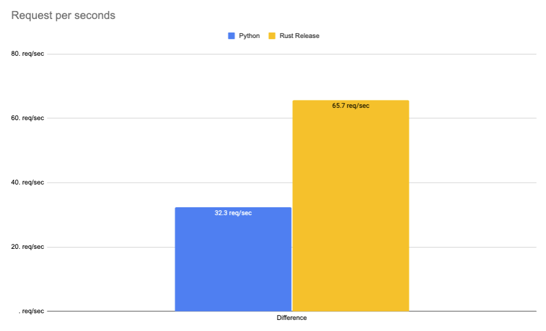

# Rust 🦀 vs Python 🐍: Webservice with decoding HTTP Body in Rust and then calling Python vs pure Python

This repository contains the code to my blog post [Rust 🦀 vs Python 🐍: JSON decoding in rust and calling python vs pure python](). It includes the code to deploy both Webservice as well as the benchmarking script.

## Code

- [Python](./python)
- [Rust](./rust)

## Deployment

**Python**

```bash
cd python && uvicorn app:app --port 8080
```

single

```bash
curl --request POST \
  --url http://127.0.0.1:8080/age \
  --header 'Content-Type: application/json' \
  --data '{
	"inputs": "I love you. I like you. I am your friend."
}'
```

**Rust**

```bash
cd rust && cargo build --release

chmod +x ./target/release/webservice
./target/release/webservice
```

## Benchmarking

For Benchmarking i used [hey](https://github.com/rakyll/hey)

```bash
hey -n 1000 -m POST -H 'Content-Type: application/json' -d '{	"inputs": "I love you. I like you. I am your friend."}' http://127.0.0.1:8080/age
```

Benchmark are run on a g4dn.xlarge on CPU.


## Results

|              | Python     | Rust Debug  | Rust Release | Difference |
|--------------|------------|-------------|--------------|------------|
| Total        | 30.9149     | 15.1572      | 15.2270       | -96,74%    |
| Slowest      | 1.9750     | 1.0032      | 1.1084      | -84,34%    |
| Fastest      | 0.0392     | 0.0526      | 0.0536       | -99,43%    |
| Average      | 1.5046     | 0.7271      | 0.7294       | -97,23%    |
| Requests/sec | 32.3469 | 65.9752 | 65.6727  | 2967,35%   |



### Rust

#### Debug

```bash
Response time histogram:
  0.053 [1]     |
  0.148 [7]     |■
  0.243 [8]     |■
  0.338 [18]    |■
  0.433 [11]    |■
  0.528 [15]    |■
  0.623 [14]    |■
  0.718 [224]   |■■■■■■■■■■■■■■■■
  0.813 [553]   |■■■■■■■■■■■■■■■■■■■■■■■■■■■■■■■■■■■■■■■■
  0.908 [147]   |■■■■■■■■■■■
  1.003 [2]     |
```

#### Release

```bash
Response time histogram:
  0.054 [1]     |
  0.159 [8]     |■
  0.265 [14]    |■
  0.370 [16]    |■
  0.476 [29]    |■■
  0.581 [8]     |■
  0.686 [58]    |■■■■
  0.792 [603]   |■■■■■■■■■■■■■■■■■■■■■■■■■■■■■■■■■■■■■■■■
  0.897 [256]   |■■■■■■■■■■■■■■■■■
  1.003 [4]     |
  1.108 [3]     |
```

### Python

```bash
Response time histogram:
  0.039 [1]     |
  0.233 [6]     |
  0.426 [6]     |
  0.620 [6]     |
  0.814 [6]     |
  1.007 [7]     |
  1.201 [14]    |■
  1.394 [17]    |■
  1.588 [929]   |■■■■■■■■■■■■■■■■■■■■■■■■■■■■■■■■■■■■■■■■
  1.781 [1]     |
  1.975 [7]     |
```