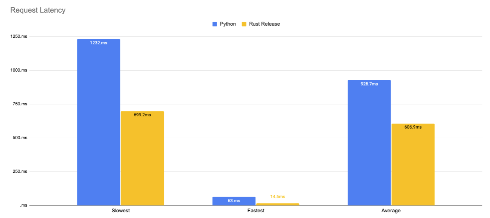

# Rust 🦀 vs Python 🐍: a ML webservice using ORT and Transformers (no optimizations)

This repository contains the code to my blog post [Rust 🦀 vs Python 🐍: a ML webservice using ORT and Transformers (no optimizations)](). It includes the code to deploy both Webservice as well as the benchmarking script.

## Code

- [Python](./python)
- [Rust](./rust)

## Deployment

**Python**

```bash
cd python && uvicorn app:app --port 8080  --workers 1
```

single

```bash
curl --request POST \
  --url http://127.0.0.1:8080/age \
  --header 'Content-Type: application/json' \
  --data '{
	"inputs": "I love you. I like you. I am your friend."
}'
```

**Rust**

```bash
cargo run --release
```

## Benchmarking

For Benchmarking i used [hey](https://github.com/rakyll/hey)

```bash
hey -n 1000 -m POST -H 'Content-Type: application/json' -d '{	"inputs": "I love you. I like you. I am your friend."}' http://127.0.0.1:8080/age
```




## Results CPU

Benchmark are run on a g4dn.xlarge on CPU.


|              | Python     | Rust Debug  | Rust Release | Difference |
|--------------|------------|-------------|--------------|------------|
| Total        | 19.6106     | 15.1139      | 12.4402    | -36,47%    |
| Slowest      | 1.2322     | 1.3775      | 0.6992       | -43,12%    |
| Fastest      | 0.0631     | 0.0153      | 0.0145       | -76,33%    |
| Average      | 0.9287     | 0.7399      | 0.6069       | -34,45%    |
| Requests/sec | 50.9929 | 80.2993 | 80.3849  | 57,46%   |

### Rust

#### Debug

```bash
Response time histogram:
  0.015 [1]     |
  0.151 [11]    |■
  0.288 [10]    |■
  0.424 [9]     |■
  0.560 [9]     |■
  0.696 [272]   |■■■■■■■■■■■■■■■■■■■■■■
  0.833 [504]   |■■■■■■■■■■■■■■■■■■■■■■■■■■■■■■■■■■■■■■■■
  0.969 [98]    |■■■■■■■■
  1.105 [37]    |■■■
  1.241 [12]    |■
  1.377 [37]    |■■■
```

#### Release

```bash
Response time histogram:
  0.015 [1]     |
  0.083 [6]     |
  0.151 [6]     |
  0.220 [5]     |
  0.288 [6]     |
  0.357 [4]     |
  0.425 [4]     |
  0.494 [4]     |
  0.562 [4]     |
  0.631 [748]   |■■■■■■■■■■■■■■■■■■■■■■■■■■■■■■■■■■■■■■■■
  0.699 [212]   |■■■■■■■■■■■
```

### Python

```bash
Response time histogram:
  0.063 [1]     |
  0.180 [6]     |
  0.297 [0]     |
  0.414 [15]    |■
  0.531 [100]   |■■■■■■■
  0.648 [26]    |■■
  0.765 [40]    |■■■
  0.881 [59]    |■■■■
  0.998 [131]   |■■■■■■■■■
  1.115 [604]   |■■■■■■■■■■■■■■■■■■■■■■■■■■■■■■■■■■■■■■■■
  1.232 [18]    |■
```