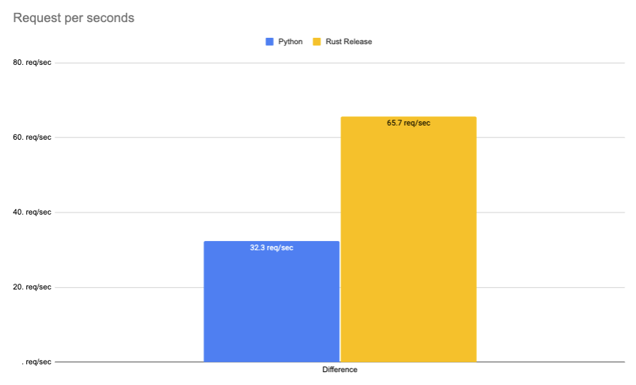
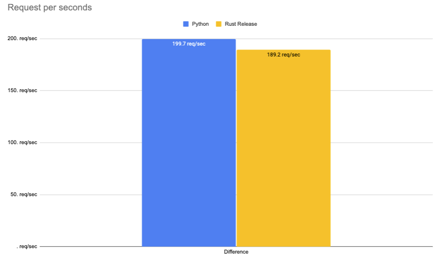

# Rust 🦀 vs Python 🐍: native webservice with python ffi calls Part 3

This repository contains the code to my blog post [Rust 🦀 vs Python 🐍: native webservice with python ffi calls](). It includes the code to deploy both Webservice as well as the benchmarking script. In this Example I used native wereservice (`actix-web` and `uvicorn + starlette`) with Python FFI calls in rust to use `transformers` and in python default `transformers`. 

## Code

- [Python](./python)
- [Rust](./rust)

## Deployment

**Python**

```bash
cd python && uvicorn app:app --port 8080  --workers 1
```

single

```bash
curl --request POST \
  --url http://127.0.0.1:8080/age \
  --header 'Content-Type: application/json' \
  --data '{
	"inputs": "I love you. I like you. I am your friend."
}'
```

**Rust**

```bash
cd rust && cargo build --release 

chmod +x ./target/release/webservice
./target/release/webservice
```

## Benchmarking

For Benchmarking i used [hey](https://github.com/rakyll/hey)

```bash
hey -n 1000 -m POST -H 'Content-Type: application/json' -d '{	"inputs": "I love you. I like you. I am your friend."}' http://127.0.0.1:8080/age
```


## Results CPU

Benchmark are run on a g4dn.xlarge on CPU.


|              | Python     | Rust Debug  | Rust Release | Difference |
|--------------|------------|-------------|--------------|------------|
| Total        | 30.9149     | 15.1572      | 15.2270       | -50,75%    |
| Slowest      | 1.9750     | 1.0032      | 1.1084      | -43,88%    |
| Fastest      | 0.0392     | 0.0526      | 0.0536       | +36,73%    |
| Average      | 1.5046     | 0.7271      | 0.7294       | -97,23%    |
| Requests/sec | 32.3469 | 65.9752 | 65.6727  | 103,03%   |



### Rust

#### Debug

```bash
Response time histogram:
  0.053 [1]     |
  0.148 [7]     |■
  0.243 [8]     |■
  0.338 [18]    |■
  0.433 [11]    |■
  0.528 [15]    |■
  0.623 [14]    |■
  0.718 [224]   |■■■■■■■■■■■■■■■■
  0.813 [553]   |■■■■■■■■■■■■■■■■■■■■■■■■■■■■■■■■■■■■■■■■
  0.908 [147]   |■■■■■■■■■■■
  1.003 [2]     |
```

#### Release

```bash
Response time histogram:
  0.054 [1]     |
  0.159 [8]     |■
  0.265 [14]    |■
  0.370 [16]    |■
  0.476 [29]    |■■
  0.581 [8]     |■
  0.686 [58]    |■■■■
  0.792 [603]   |■■■■■■■■■■■■■■■■■■■■■■■■■■■■■■■■■■■■■■■■
  0.897 [256]   |■■■■■■■■■■■■■■■■■
  1.003 [4]     |
  1.108 [3]     |
```

### Python

```bash
Response time histogram:
  0.019 [1]     |
  0.051 [6]     |
  0.083 [7]     |■
  0.114 [7]     |■
  0.146 [7]     |■
  0.178 [39]    |■■■
  0.210 [0]     |
  0.242 [528]   |■■■■■■■■■■■■■■■■■■■■■■■■■■■■■■■■■■■■■■■■
  0.274 [317]   |■■■■■■■■■■■■■■■■■■■■■■■■
  0.306 [40]    |■■■
  0.338 [48]    |■■■■
```


## Results GPU

Benchmark are run on a g4dn.xlarge on GPU. With Workers 1


|              | Python     | Rust Debug  | Rust Release | Difference |
|--------------|------------|-------------|--------------|------------|
| Total        | 5.0085     | 4.7305      | 4.3720      | +5,52%    |
| Slowest      | 0.2988     | 0.2561      | 0.2230      | +16,87%    |
| Fastest      | 0.0119     | 0.0112      | 0.0069       | +98,32%    |
| Average      | 0.2427     | 0.2308      | 0.2130       | +5,4%    |
| Requests/sec | 199.6598 | 211.3957 | 228.7281  | 5,23%   |



### Rust

#### Debug

```bash
Response time histogram:
  0.011 [1]     |
  0.036 [5]     |
  0.060 [5]     |
  0.085 [5]     |
  0.109 [5]     |
  0.134 [5]     |
  0.158 [5]     |
  0.183 [5]     |
  0.207 [6]     |
  0.232 [15]    |■
  0.256 [943]   |■■■■■■■■■■■■■■■■■■■■■■■■■■■■■■■■■■■■■■■■
```

#### Release

```bash
Response time histogram:
  0.007 [1]     |
  0.028 [5]     |
  0.050 [5]     |
  0.072 [5]     |
  0.093 [5]     |
  0.115 [5]     |
  0.137 [5]     |
  0.158 [5]     |
  0.180 [5]     |
  0.201 [5]     |
  0.223 [954]   |■■■■■■■■■■■■■■■■■■■■■■■■■■■■■■■■■■■■■■■■
```

### Python

```bash
Response time histogram:
  0.039 [1]     |
  0.233 [6]     |
  0.426 [6]     |
  0.620 [6]     |
  0.814 [6]     |
  1.007 [7]     |
  1.201 [14]    |■
  1.394 [17]    |■
  1.588 [929]   |■■■■■■■■■■■■■■■■■■■■■■■■■■■■■■■■■■■■■■■■
  1.781 [1]     |
  1.975 [7]     |
```


### GPU 10k requests
```bash
 hey -n 10000 -m POST -H 'Content-Type: application/json' -d '{"inputs": "I love you. I like you. I am your friend."}' http://127.0.0.1:8080/age
```

### Rust
```bash

Summary:
  Total:        52.6566 secs
  Slowest:      0.2706 secs
  Fastest:      0.0082 secs
  Average:      0.2625 secs
  Requests/sec: 189.9098
  
  Total data:   400000 bytes
  Size/request: 40 bytes

Response time histogram:
  0.008 [1]     |
  0.034 [14]    |
  0.061 [5]     |
  0.087 [5]     |
  0.113 [5]     |
  0.139 [5]     |
  0.166 [6]     |
  0.192 [5]     |
  0.218 [8]     |
  0.244 [19]    |
  0.271 [9927]  |■■■■■■■■■■■■■■■■■■■■■■■■■■■■■■■■■■■■■■■■
```
```bash
### Python
  Summary:
  Total:        51.3509 secs
  Slowest:      0.3364 secs
  Fastest:      0.0137 secs
  Average:      0.2561 secs
  Requests/sec: 194.7387
  
  Total data:   490000 bytes
  Size/request: 49 bytes

Response time histogram:
  0.014 [1]     |
  0.046 [5]     |
  0.078 [5]     |
  0.110 [12]    |
  0.143 [1]     |
  0.175 [3]     |
  0.207 [6]     |
  0.240 [1145]  |■■■■■■■■
  0.272 [5868]  |■■■■■■■■■■■■■■■■■■■■■■■■■■■■■■■■■■■■■■■■
  0.304 [2876]  |■■■■■■■■■■■■■■■■■■■■
  0.336 [78]    |■
```