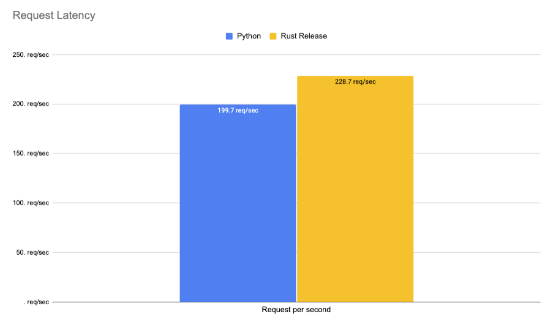

# Rust 🦀 vs Python 🐍: native webservice with python ffi calls Part 3

This repository contains the code to my blog post [Rust 🦀 vs Python 🐍: native webservice with python ffi calls](). It includes the code to deploy both Webservice as well as the benchmarking script. In this Example I used native wereservice (`actix-web` and `uvicorn + starlette`) with Python FFI calls in rust to use `transformers` and in python default `transformers`. 

## Code

- [Python](./python)
- [Rust](./rust)

## Deployment

**Python**

```bash
cd python && uvicorn app:app --port 8080  --workers 1
```

single

```bash
curl --request POST \
  --url http://127.0.0.1:8080/age \
  --header 'Content-Type: application/json' \
  --data '{
	"inputs": "I love you. I like you. I am your friend."
}'
```

**Rust**

```bash
cd rust && cargo build --release 

chmod +x ./target/release/webservice
./target/release/webservice
```

## Load testing with Locust

_`pip install locust`_ 

run on `g4dn.xlarge`

**headless**

```bash
locust --headless --users 15 --spawn-rate 1 -H  http://127.0.0.1:8080 -f locust_benchmark.py --run-time 180s
```

**with ui**

```bash
locust --users 15 --spawn-rate 1 -H  http://127.0.0.1:8080 -f locust_benchmark.py
```

**CPU**

|        | AVG | MIN | MAX | MEDIAN | REQ/SEC |
|--------|-----|-----|-----|--------|---------|
| Python | 462 | 33  | 865 | 480    | 30.9    |
| Rust   | 443 | 32  | 695 | 470    | 31.3    |

**GPU**
|        | AVG | MIN | MAX | MEDIAN | REQ/SEC |
|--------|-----|-----|-----|--------|---------|
| Python | 66  | 5   | 130 | 68     | 206.3   |
| Rust   | 58  | 4   | 104 | 60     | 245.8   |

### Results 

#### GPU

**Python (latency in ms)**

```bash
Avg     Min     Max  Median  |   req/s failures/s
--------------------------------------------------
66       5     130      68  |  206.30 
```

```bash
 Type     Name   50%    66%    75%    80%    90%    95%    98%    99%  99.9% 99.99%   100% # reqs
--------|------------|---------|------|------|------|------|------|------|------|------|------|------|------|
 POST     /age    68     71     73     73     75     77     81     86    100    130    130  37610
```

**Rust (latency in ms)** 

```bash
 Avg     Min     Max  Median  |   req/s failures/s
---------------------------------------------------
 58       4     104      60 |  245.80
```

```bash
 Type     Name  50%    66%    75%    80%    90%    95%    98%    99%  99.9% 99.99%   100% # reqs
--------|----|---------|------|------|------|------|------|------|------|------|------|------|------|
 POST     /age  60     60     60     61     67     70     72     77     96    110    110  43833
```

#### CPU


**Python**

```Bash
 Avg     Min     Max  Median  |   req/s failures/s
-------------------------------------------------
 462      33     865     480  |   30.9
```

```bash
 Type     Name  50%    66%    75%    80%    90%    95%    98%    99%  99.9% 99.99%   100% # reqs
--------|--------|---------|------|------|------|------|------|------|------|------|------|------|------|
 POST     /age    480    480    490    490    500    500    510    510    510    870    870   5556
```

**Rust** 

```bash
  Avg     Min     Max  Median  |   req/s failures/s
----------------------------------------------------
 443      32     695     470  |   31.30 
```

```bash
 Type     Name  50%    66%    75%    80%    90%    95%    98%    99%  99.9% 99.99%   100% # reqs
--------|---------|---------|------|------|------|------|------|------|------|------|------|------|------|
 POST     /age  470    480    490    490    500    500    540    560    640    700    700   5614
```


## Benchmarking

For Benchmarking i used [hey](https://github.com/rakyll/hey)

```bash
hey -n 1000 -m POST -H 'Content-Type: application/json' -d '{	"inputs": "I love you. I like you. I am your friend."}' http://127.0.0.1:8080/age
```


## Results CPU

Benchmark are run on a g4dn.xlarge on CPU.


|              | Python  | Rust Debug | Rust Release | Difference |
| ------------ | ------- | ---------- | ------------ | ---------- |
| Total        | 30.9149 | 15.1572    | 15.2270      | -50,75%    |
| Slowest      | 1.9750  | 1.0032     | 1.1084       | -43,88%    |
| Fastest      | 0.0392  | 0.0526     | 0.0536       | +36,73%    |
| Average      | 1.5046  | 0.7271     | 0.7294       | -97,23%    |
| Requests/sec | 32.3469 | 65.9752    | 65.6727      | 103,03%    |


### Rust

#### Debug

```bash
Response time histogram:
  0.053 [1]     |
  0.148 [7]     |■
  0.243 [8]     |■
  0.338 [18]    |■
  0.433 [11]    |■
  0.528 [15]    |■
  0.623 [14]    |■
  0.718 [224]   |■■■■■■■■■■■■■■■■
  0.813 [553]   |■■■■■■■■■■■■■■■■■■■■■■■■■■■■■■■■■■■■■■■■
  0.908 [147]   |■■■■■■■■■■■
  1.003 [2]     |
```

#### Release

```bash
Response time histogram:
  0.054 [1]     |
  0.159 [8]     |■
  0.265 [14]    |■
  0.370 [16]    |■
  0.476 [29]    |■■
  0.581 [8]     |■
  0.686 [58]    |■■■■
  0.792 [603]   |■■■■■■■■■■■■■■■■■■■■■■■■■■■■■■■■■■■■■■■■
  0.897 [256]   |■■■■■■■■■■■■■■■■■
  1.003 [4]     |
  1.108 [3]     |
```

### Python

```bash
Response time histogram:
  0.019 [1]     |
  0.051 [6]     |
  0.083 [7]     |■
  0.114 [7]     |■
  0.146 [7]     |■
  0.178 [39]    |■■■
  0.210 [0]     |
  0.242 [528]   |■■■■■■■■■■■■■■■■■■■■■■■■■■■■■■■■■■■■■■■■
  0.274 [317]   |■■■■■■■■■■■■■■■■■■■■■■■■
  0.306 [40]    |■■■
  0.338 [48]    |■■■■
```


## Results GPU

Benchmark are run on a g4dn.xlarge on GPU. With Workers 1


|              | Python   | Rust Debug | Rust Release | Difference |
| ------------ | -------- | ---------- | ------------ | ---------- |
| Total        | 5.0085   | 4.7305     | 4.3720       | -5,52%     |
| Slowest      | 0.2988   | 0.2561     | 0.2230       | -16,87%    |
| Fastest      | 0.0119   | 0.0112     | 0.0069       | -98,32%    |
| Average      | 0.2427   | 0.2308     | 0.2130       | -5,4%      |
| Requests/sec | 199.6598 | 211.3957   | 228.7281     | -5,23%     |



### Rust

#### Debug

```bash
Response time histogram:
  0.011 [1]     |
  0.036 [5]     |
  0.060 [5]     |
  0.085 [5]     |
  0.109 [5]     |
  0.134 [5]     |
  0.158 [5]     |
  0.183 [5]     |
  0.207 [6]     |
  0.232 [15]    |■
  0.256 [943]   |■■■■■■■■■■■■■■■■■■■■■■■■■■■■■■■■■■■■■■■■
```

#### Release

```bash
Response time histogram:
  0.007 [1]     |
  0.028 [5]     |
  0.050 [5]     |
  0.072 [5]     |
  0.093 [5]     |
  0.115 [5]     |
  0.137 [5]     |
  0.158 [5]     |
  0.180 [5]     |
  0.201 [5]     |
  0.223 [954]   |■■■■■■■■■■■■■■■■■■■■■■■■■■■■■■■■■■■■■■■■
```

### Python

```bash
Response time histogram:
  0.013 [1]     |
  0.049 [7]     |■
  0.085 [6]     |■
  0.121 [8]     |■
  0.156 [7]     |■
  0.192 [8]     |■
  0.228 [26]    |■■
  0.264 [395]   |■■■■■■■■■■■■■■■■■■■■■■■■■■■■■■■■■■
  0.300 [461]   |■■■■■■■■■■■■■■■■■■■■■■■■■■■■■■■■■■■■■■■■
  0.336 [35]    |■■■
  0.372 [46]    |■■■■
```