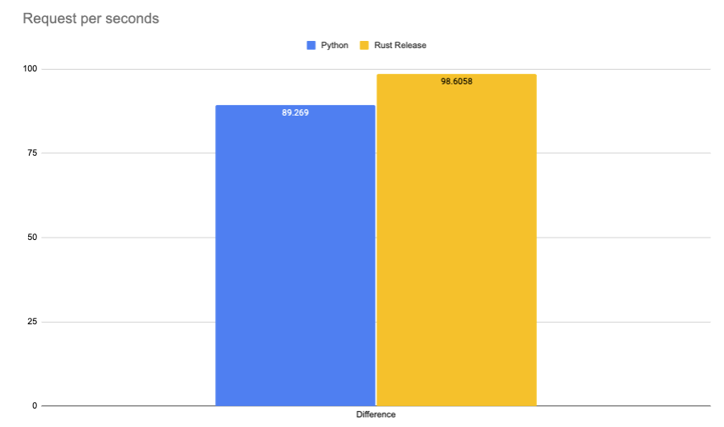

# Rust 🦀 vs Python 🐍: Webservice with decoding HTTP Body in Rust and then calling Python vs pure Python

This repository contains the code to my blog post [Rust 🦀 vs Python 🐍: JSON decoding in rust and calling python vs pure python](). It includes the code to deploy both Webservice as well as the benchmarking script.

## Code

- [Python](./python)
- [Rust](./rust)

## Deployment

**Python**

```bash
cd python && uvicorn app:app --port 8080  --workers 1
```

single

```bash
curl --request POST \
  --url http://127.0.0.1:8080/age \
  --header 'Content-Type: application/json' \
  --data '{
	"inputs": "I love you. I like you. I am your friend."
}'
```

**Rust**

```bash
cd rust && cargo build --release 

chmod +x ./target/release/webservice
cargo run --release
```
or
```Bash
export LD_LIBRARY_PATH=path/to/onnxruntime-linux-x64-gpu-1.8.0/lib:${LD_LIBRARY_PATH}
./target/release/onnx-server

```

## Benchmarking

For Benchmarking i used [hey](https://github.com/rakyll/hey)

```bash
hey -n 1000 -m POST -H 'Content-Type: application/json' -d '{	"inputs": "I love you. I like you. I am your friend."}' http://127.0.0.1:8080/age
```


## Results CPU

Benchmark are run on a g4dn.xlarge on CPU.


|              | Python     | Rust Debug  | Rust Release | Difference |
|--------------|------------|-------------|--------------|------------|
| Total        | 11.2021     | 12.6463      | 10.1414       | -9,47%    |
| Slowest      | 0.7423     | 0.9300      | 0.5187      | -30,12%    |
| Fastest      | 0.0300     | 0.0212      | 0.0131       | -56,33%    |
| Average      | 0.5463     | 0.6181      | 0.4947       | -9,45%    |
| Requests/sec | 89.2690 | 79.0742 | 98.6058  | 10,46%   |



### Rust

#### Debug

```bash
Response time histogram:
  0.021 [1]     |
  0.112 [4]     |
  0.203 [5]     |
  0.294 [6]     |
  0.385 [5]     |
  0.476 [4]     |
  0.566 [701]   |■■■■■■■■■■■■■■■■■■■■■■■■■■■■■■■■■■■■■■■■
  0.657 [62]    |■■■■
  0.748 [19]    |■
  0.839 [18]    |■
  0.930 [175]   |■■■■■■■■■■
```

#### Release

```bash
Response time histogram:
  0.013 [1]     |
  0.067 [5]     |
  0.121 [5]     |
  0.174 [5]     |
  0.228 [5]     |
  0.282 [6]     |
  0.335 [5]     |
  0.389 [6]     |
  0.443 [5]     |
  0.497 [6]     |
  0.550 [951]   |■■■■■■■■■■■■■■■■■■■■■■■■■■■■■■■■■■■■■■■■
```

### Python

```bash
Response time histogram:
  0.017 [1]     |
  0.075 [5]     |
  0.133 [5]     |
  0.192 [7]     |
  0.250 [3]     |
  0.308 [6]     |
  0.366 [5]     |
  0.424 [6]     |
  0.483 [5]     |
  0.541 [63]    |■■■
  0.599 [894]   |■■■■■■■■■■■■■■■■■■■■■■■■■■■■■■■■■■■■■■■■
```