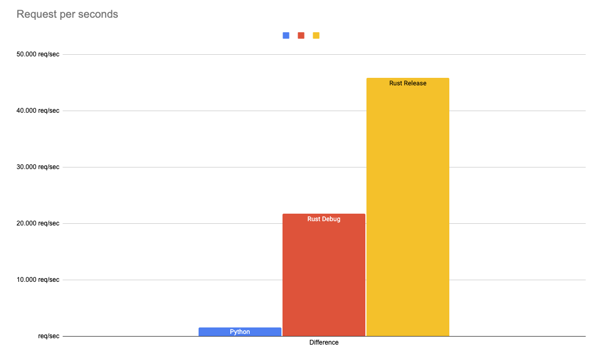

# Rust 🦀 vs Python 🐍: a webservice comparison Part 2

This repository contains the code to my blog post [Rust 🦀 vs Python 🐍: a webservice comparison Part 2](). It includes the code to deploy both Webservice as well as the benchmarking script.

## Code

- [Python](./python)
- [Rust](./rust)

## Deployment

**Python**

```bash
cd python && uvicorn app:app --port 8080
```

single

```bash
curl --request POST \
  --url http://127.0.0.1:8080/age \
  --header 'Content-Type: application/json' \
  --data '{
	"name": "Philipp Schmid",
	"age": 25
}'
```

**Rust**

```bash
cd rust && cargo build --release

chmod +x ./target/release/webservice
./target/release/webservice
```

## Benchmarking

For Benchmarking i used [hey](https://github.com/rakyll/hey)

```bash
hey -n 1000 -m POST -H 'Content-Type: application/json' -d '{"name":"Philipp Schmid","age":25}' http://127.0.0.1:8080/age
```

## Results

|              | Python     | Rust Debug  | Rust Release | Difference |
|--------------|------------|-------------|--------------|------------|
| Total        | 0,6686     | 0,0460      | 0,0218       | -96,74%    |
| Slowest      | 0,0415     | 0,0109      | 0,0065       | -84,34%    |
| Fastest      | 0,0175     | 0,0003      | 0,0001       | -99,43%    |
| Average      | 0,0325     | 0,0021      | 0,0009       | -97,23%    |
| Requests/sec | 1.495,5691 | 21.746,6538 | 45.874,3437  | 2967,35%   |



### Rust

#### Debug

```bash
Response time histogram:
  0.000 [1]     |
  0.001 [348]   |■■■■■■■■■■■■■■■■■■■■■■■■■■■■■■■■■■■■■■■
  0.002 [357]   |■■■■■■■■■■■■■■■■■■■■■■■■■■■■■■■■■■■■■■■■
  0.003 [164]   |■■■■■■■■■■■■■■■■■■
  0.005 [76]    |■■■■■■■■■
  0.006 [35]    |■■■■
  0.007 [10]    |■
  0.008 [7]     |■
  0.009 [0]     |
  0.010 [0]     |
  0.011 [2]     |
```

#### Release

```bash
Response time histogram:
  0.000 [1]     |
  0.001 [590]   |■■■■■■■■■■■■■■■■■■■■■■■■■■■■■■■■■■■■■■■■
  0.001 [226]   |■■■■■■■■■■■■■■■
  0.002 [61]    |■■■■
  0.003 [70]    |■■■■■
  0.003 [39]    |■■■
  0.004 [4]     |
  0.005 [7]     |
  0.005 [1]     |
  0.006 [0]     |
  0.007 [1]     |
```

### Python

```bash
Response time histogram:
  0.018 [1]     |
  0.020 [5]     |■
  0.022 [6]     |■
  0.025 [4]     |■
  0.027 [27]    |■■■■
  0.030 [144]   |■■■■■■■■■■■■■■■■■■■■■■
  0.032 [266]   |■■■■■■■■■■■■■■■■■■■■■■■■■■■■■■■■■■■■■■■■
  0.034 [231]   |■■■■■■■■■■■■■■■■■■■■■■■■■■■■■■■■■■■
  0.037 [205]   |■■■■■■■■■■■■■■■■■■■■■■■■■■■■■■■
  0.039 [70]    |■■■■■■■■■■■
  0.041 [41]    |■■■■■■
```